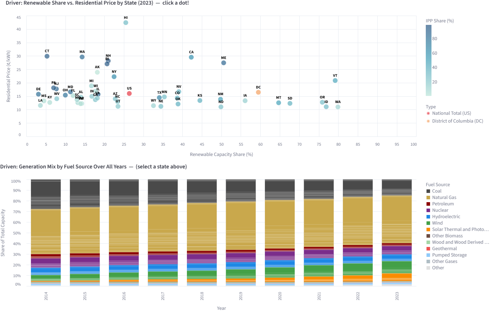

# U.S. Electricity Market Transformation (2014–2023)

## Contributors
- Yerin Yun (yryun2)
- Brisa Jasso (bjass2)

## Summary
The U.S. electricity market has experienced significant structural changes over the past decade, driven by the rapid growth of renewable energy, the rise of Independent Power Producers (IPPs), and shifting patterns in electricity consumption across sectors. This project analyzes how electricity use and electricity prices have changed across U.S. states from 2014 to 2023, with a particular focus on the relationship between who generates power and what consumers ultimately pay for it. 

Historically, electricity generation in the U.S. was dominated by traditional Electric Utilities, which are responsible for both generating and distributing power within their service territories. Over time, deregulation and the declining cost of renewable technologies have allowed Independent Power Producers to enter the market. It led to creating more competitive and diverse generation landscapes across states. My team wanted to understand whether this shift has translated into meaningful differences in electricity prices for residential, commercial, and industrial customers.

This project uses two datasets from the U.S. Energy Information Administration (EIA). The first is the EIA-860 dataset, which represents the supply side of the electricity market and provides annual information on power plant capacity, producer type, and fuel sources including coal, natural gas, wind, and solar across all U.S. states. The second is the EIA-861 dataset, which captures the demand side and includes annual electricity sales measured in megawatt-hours, revenues, customer counts, and average prices in cents per kilowatt-hour, broken down by sector and state. By merging these two datasets on shared State and Year identifiers, we created a granular dataset with one row per state, year, producer type, and fuel source, covering both the generation infrastructure and the consumption patterns of each state over the ten-year period. 

This integrated dataset, this project answers three research questions. 
1. Do states with a higher percentage of Independent Power Producers have lower average residential electricity prices compared to states dominated by traditional Electric Utilities? 
2. Do states with a higher share of renewable generation capacity, such as wind and solar, have higher or lower average electricity prices across residential, commercial, and industrial sectors compared to states that rely more heavily on fossil fuels? 
3. How do trends in electricity use per customer differ across residential, commercial, and industrial sectors when a state's total generation capacity changes significantly? 

To answer these questions, we created columns of IPP Share, Renewable Share, and Fossil Share. These metrics allow us to compare states along both supply-side and demand-side dimensions and to track how changes in generation structure correspond with changes in electricity pricing and consumption over time. 

Key findings are that states with higher renewable capacity shares do not uniformly have higher or lower electricity prices. It indicates that electricity pricing is connected to other factors such as regulatory, geographics, and infrastructure investments. States with greater IPP presence show varied price outcomes depending on regional market structures. A more detailed discussion of findings, including visualizations and regression results, is provided in the Findings section of this report. 

## Data Profile
EIA-861: Annual Electric Power Industry Report
The EIA-861 dataset, released October 7, 2025, represents the demand side of the U.S. electricity market. It is sourced from the U.S. Energy Information Administration and is available at https://www.eia.gov/electricity/data/state/. The dataset reports annual electricity sales to ultimate customers by state and sector, covering the years 2014 through 2023 for the purposes of this project. In its original form, the Excel file uses a three-level header structure spanning Residential, Commercial, Industrial, Transportation, and Total categories, each further divided into Revenues (thousand dollars), Sales (MWh), Customers (count), and Price (cents/kWh). This results in 22 columns before flattening. After flattening the multi-level headers into a single row using Python, the dataset was saved as EIA_861_Total_Electric_Industry_clean.csv and stored in the data directory of the project repository. This dataset addresses all three research questions about the price and consumption outcomes. Residential, commercial, and industrial sector prices in cents per kilowatt-hour are the primary dependent variables across the analysis. 

EIA-860: Annual Electric Generator Report
The EIA-860 dataset, released September 9, 2025, represents the supply side of the U.S. electricity market. Also sourced from the EIA at https://www.eia.gov/electricity/data/state/, it reports existing nameplate and net summer capacity by energy source, producer type, and state. The full historical file spans 1990 to 2024 and contains 55,892 rows and 8 columns. For this project, we filtered the dataset to the years 2014 through 2023 to align with the EIA-861 coverage. The columns are Year, State Code, Producer Type, Fuel Source, Generators, Facilities, Nameplate Capacity (Megawatts), and Summer Capacity (Megawatts). Producer types include Electric Generators (Electric Utilities), Electric Generators (Independent Power Producers), Combined Heat and Power, Commercial Power, and Industrial Power. Fuel sources include 13 categories: Coal, Natural Gas, Petroleum, Nuclear, Hydroelectric, Wind, Solar Thermal and Photovoltaic, Geothermal, Wood and Wood Derived Fuels, Other Biomass, Other Gases, Pumped Storage, and Other. The cleaned file is stored as EIA_860_clean.csv in the data directory of the project repository. 

This dataset introduces the supply-side variables, especially producer type for the IPP share question and fuel source capacity for the renewable and fossil share comparison question. Nameplate capacity in megawatts is a key supply-side metric used to calculate share indicators.

There are no ethical or legal constraints associated with these two datasets. According to EIA's public domain policy, all U.S. government publications and data are not subject to copyright protection. Users may freely use, share, and reproduce EIA data with appropriate attribution. 

The two datasets were merged on the shared keys of Year and State Code using an inner join, producing EIA_merged_final.csv, which contains 10,800 rows and 28 columns. Each row represents a unique combination of state, year, producer type, and fuel source, with all EIA-861 demand-side columns attached at the state-year level. A second derived file, fuel_merged.csv, was created by aggregating the merged dataset to the state-year-fuel source level (4,787 rows, 10 columns) and attaching calculated share indicators: renew_share, fossil_share, ipp_share, along with residential, commercial, and industrial prices. Both output files are stored in the data directory of the Github project repository. 

## Data Quality
The data quality assessment was applied on both the raw and cleaned version of each dataset. 
The EIA-860 dataset was mostly clean originally when my team inspected it on OpenRefine. All 8 columns were correctly typed, but one missing value was found in the Summer Capacity column across the full merged dataset. The dataset contained rows labeled “All Sources” in the Fuel Source column, however, my team excluded while we filtered it to prevent double count of capacity totals. 

The EIA-861 dataset has a more significant quality issue. The original Excel file has a three-level column header. The sector category names (i.e. Residential) and subcategories (i.e. Revenue), and units(i.e. Thousand Dollars) are spread across three rows. It was a structural quality issue rather than a content quality issue, and it was resolved during the cleaning step. 

After merging, the dataset EIA_merged_final.csv contains only 1 missing value in the Summer Capacity column. There were no duplicate rows found in the merged dataset after the inner join. The fuel_merged.csv summary table contains 4,787 rows with 9 rows dropped due to missing values in renew_share or res_price during the summary calculation step. 

Both EIA datasets have reasonably clear column names that make the fields largely self-explanatory. Column names like Nameplate Capacity (Megawatts), Producer Type, and Price (Cents/kWh) are straightforward in their meaning without requiring a separate codebook. The datasets also include a release date, which provides a basic point of provenance. However, neither dataset explains its data collection process of how generator capacity figures are reported, who submits them, or how the EIA validates submissions. 

Overall, the EIA datasets are reliable and cleanly structured, but their documentation assumes familiarity with the electricity industry. For a general user, the absence of a data dictionary, collection methodology description, and field-level definitions creates friction that good documentation would eliminate.

## Data Cleaning
The EIA-860 dataset was first opened in OpenRefine to visually inspect the structure and filter the data. Two operations were performed in OpenRefine: the Year column was filtered to retain only rows from 2014 to 2023, reducing the dataset from 55,892 rows to the working range, and rows where Fuel Source was "All Sources" were removed to prevent double-counting of total capacity figures. The filtered dataset was exported as EIA-860.csv. In Python, the file was read using pd.read_csv('EIA-860.csv', header=1), passing header=1 to use the second row as column names since the first row of the exported file contained a title string rather than headers. The cleaned file was saved as EIA_860_clean.csv.  

The EIA-861 dataset required more preprocessing due to its three-level header structure. The file was read using pd.read_excel() with header=[0,1,2] to capture all three header levels as a MultiIndex. A custom loop then flattened the MultiIndex into single descriptive column names using the format "{Category} - {Subcategory} ({Unit})", for example "RESIDENTIAL - Price (Cents/kWh)". The first two columns were renamed to Year and STATE directly. This produced a flat, consistently named column structure suitable for analysis and merging. The cleaned file was saved as EIA_861_Total_Electric_Industry_clean.csv.

The two cleaned datasets were merged using an inner join on Year and State Code. The duplicate STATE column from EIA-861 was dropped after the merge. Rows where Producer Type equaled "Total Electric Power Industry" were removed to eliminate summary rows that would double-count capacity figures. The result was saved as EIA_merged_final.csv with 10,800 rows.
From this merged dataset, a second processed file fuel_merged.csv was created by defining fuel categories (renewable fuels: Wind, Solar Thermal and Photovoltaic, Hydroelectric, Geothermal, Wood and Wood Derived Fuels, Other Biomass; fossil fuels: Coal, Natural Gas, Petroleum, Other Gases), grouping by state and year, and calculating renew_share, fossil_share, and ipp_share as percentages of total nameplate capacity. Residential, commercial, and industrial prices were attached at the state-year level. Rows with missing share or price values were dropped, resulting in 4,787 rows.

## Findings
We conducted a regression analysis to test if higher renewable share is associated with electricity prices. The final models used a stat-fixed effects OLS regression model with HC3 robust standard errors. Specifically, there were three final models (one for each sector type of residential, commercial, and industrial) that modeled the relationship between electricity prices and renewable energy, holding fossil share, IPP share, Year, and State constant. 

Across all three models, renewable energy share had a negative and  statistically significant association with electricity prices. For the residential sector, a one percentage point increase in renewable share was associated with a 0.366 ¢/kWh decrease (p = 0.005; 95% CI: −0.623, −0.110). The commercial sector showed a 0.329 ¢/kWh decrease per percentage point increase in renewable share (p = 0.004; 95% CI: −0.556, −0.103). The industrial sector prices decreased by 0.311 ¢/kWh (p = 0.007; 95% CI: −0.536, −0.085). Thus, all three results were statistically significant at the 0.01 level.

We can see that the model explained a high portion of variation in electricity prices, with adjusted R² values of 0.925, 0.941, and 0.942 for residential, commercial, and industrial models respectively. This reflects a strong explanatory power when we look at the state-fixed effects. 

Overall, our regression analysis findings suggest that states with more renewable energy tend to have lower electricity prices over time. This makes intuitive sense since once renewable energy sources are built, the fuel is free and operating renewables becomes cheaper than operating coal or natural gas plants. An important conclusion from these findings is that even across the three sectors, we still saw the price reducing effects, meaning that customers from all sectors get to benefit from a state’s transition to cleaner energy.

**Interactive Dashboard:** [U.S. Electricity Market Explorer](https://huggingface.co/spaces/yryun2/US_Electricity_Dashboard)

We also created a visualization on Hugging Face. This interactive dashboard is to depict the energy usage of states in the US from 2014-2023. To use this dashboard, start by selecting a specific Year and Price Sector (Residential, Commercial, or Industrial) from the controls on the top-left to see how the electricity market looked at that time. The top chart displays each state as a dot; its position shows the balance between that state's Renewable Capacity and its Electricity Price, while the color indicates the influence of Independent Power Producers (IPPs), which are the private energy producers. The Renewable Capacity is the percentage of the state's clean energy usage. The Electricity Price is simply the price of electricity in the state by cents per kilowatt. Users can click on any state's dot to lock in your selection, which updates the bottom chart to reveal that state’s complete energy usage breakdown. 

Across the 2014–2023 period, average residential electricity prices increased steadily from 13.16 cents/kWh in 2014 to 16.64 cents/kWh in 2023, with the sharpest increase occurring after 2021. Commercial prices rose from 11.05 to 12.95 cents/kWh and industrial prices from 8.11 to 9.43 cents/kWh over the same period. This increasing pricing trend was consistent across all sectors and was visible in the line plot generated from the merged dataset.

In the first research question, states with higher IPP share did not uniformly show lower residential prices. The IPP share across states ranged from 0.4% to 99.4% with a mean of approximately 38%, which reflects wide variation in state-level deregulation. The relationship between IPP share and price appears to depend heavily on regional market structure rather than IPP presence alone. Regarding the second research question, renewable share across states averaged approximately 23%, ranging from 1.2% to 83.2%. States with high renewable capacity, such as those with significant wind or hydroelectric resources, didn’t consistently show higher or lower prices. It suggests that fuel mix alone can’t determine electricity price outcomes without considering infrastructure costs, regulatory, and other energy market context. For the third research question, trends in electricity use per customer varied across sectors as state capacity changed, with industrial customers showing more sensitivity to capacity shifts than residential customers.

## Future Work
The goal of this project was to understand the relationship between renewable energy and electricity prices across U.S. states and different customer sectors. We were able to learn a lot from our analysis, but there is always room for improvement.
The first thing our team would like to explore in the future is learning more about renewable energy in the modern world, especially as renewable energy becomes increasingly popular. The data we used was historical data from 2014 to 2023, and gave us a good basis for understanding how renewable energy has impacted electricity prices over time. However, the energy landscape is changing rapidly. Solar and battery storage costs have continued to fall sharply in recent years, and several states have set ambitious targets to reach 100% clean energy within the next decade. Incorporating more recent data as it becomes available would allow future analyses to capture whether the negative association we found between renewable share and prices strengthens over time as the technology matures and upfront infrastructure costs are recovered. 

A second avenue for future work involves incorporating additional policy variables. States have adopted renewable energy policies at very different rates and approaches. The current model controls for time and state differences through fixed effects, but it cannot account for time-varying policy changes within states. Including policy indicators as additional control variables would help distinguish whether price changes are driven by the renewable energy mix itself or by the regulatory environment that we see rising.
Another future consideration is expanding our data. As we completed the regression analysis, we had to consider all the levels and factors that can affect our prices and had to make choices like controlling for state or separating the sector levels. Another level to consider is geographic dimensions. For example, a state like California contains both expensive urban utilities and cheaper rural co-ops, so aggregating these together can obscure meaningful patterns. Expanding the data to be more detailed and on a smaller geographical scale could reveal more insights or findings.

Furthermore, our project measured renewable energy adoption through capacity share. However, it could be more accurate to represent it through generation share, which is how much electricity renewables actually produced and can better showcase the market impact. A state could have a high renewable capacity share but still generate most of its electricity from natural gas if wind is not blowing and the sun is not shining. Future analysis using generation share rather than capacity share could produce different and potentially more precise estimates.

Finally, the third research question — how electricity use per customer changes as state capacity shifts — was the least developed in our current analysis and represents the clearest opportunity for deeper work. Time-series modeling at the state level, or panel models that interact capacity changes with sector type, could reveal whether industrial customers genuinely respond differently to generation mix changes than residential customers, and whether efficiency improvements or economic factors are driving consumption trends.

## Challenges
Throughout this project, our team encountered several challenges that required us to slow down, research, and make careful decisions before moving forward.

The first challenge we encountered was the lack of documentation for both datasets. Both EIA datasets are publicly available and were decently clean and well-structured, but they assume a level of familiarity with the electricity industry that part of our team did not have coming in. There was no documentation of field meaning or context, which meant that understanding what certain columns actually represented required outside research. For example, understanding the difference between nameplate capacity and summer capacity, or knowing what producer types like Combined Heat and Power actually meant in practice, required us to look beyond the dataset itself. This slowed down our early progress and reminded us that working with real world data often requires extra research and communication from a team.

A second and closely related challenge was the broader context of the electricity market itself. Electricity generation and pricing is a niche and technical topic, and a lot of the language surrounding it was unfamiliar to us at the start of the project. Understanding not just what the data said, but what it meant in the real world, was something we had to actively work toward throughout the project. This was especially important during the analysis and findings stages, where we needed to interpret our regression results in a way that connected back to how electricity markets actually function. We addressed this by researching concepts as they came up and leaning on external resources to build enough background knowledge to speak confidently about our findings.

The third and most technically demanding challenge was merging the two datasets. Our original plan was to structure the EIA-860 data at the State-Year level and the EIA-861 data at the State-Year-Fuel level, but as we worked more closely with the data, it became clear that this structure did not align well with our research questions. The EIA-861 data was organized by customer sector, not by fuel source, so the structure needed to reflect that. Deciding what each row in the final merged dataset should represent required us to think carefully about what unit of analysis made the most sense for answering our research questions. We ultimately landed on State-Year-Sector for the demand side and State-Year for the supply side, but that decision involved a lot of discussion and constant review of our project plan to keep us on track. This challenge reinforced how important it is to think through data structure decisions early, since choices made at the merging stage affect every following step of the analysis.

Overall, these challenges taught us that data analysis is not just about writing code. It is crucial to understand your data, the context it lives in, and that making thoughtful structural decisions before running any models are just as important as the technical steps themselves. Additionally, prior to taking IS 477, I did not know the value of data documentation and how much impact that has on the data user. This project let us explore every step of the data lifecycle and how they all work together.

## Reproducing
1. Clone the project GitHub repository to your local machine.
2. Install required Python packages by running pip install -r requirements.txt.
3. Download the raw data files from the U.S. Energy Information Administration at https://www.eia.gov/electricity/data/state/: download HS861 2010-.xlsx (EIA-861) and Existcapacity_annual.xlsx (EIA-860) and place them in the data/raw/ folder of the repository. (If files exceed 50MB and are hosted on Box, download from the Box link provided in the repository and save to the same location.)
4. Open EIA-860.xlsx in OpenRefine, filter the Year column to 2014–2023, remove rows where Fuel Source equals "All Sources", and export as EIA-860.csv into data/raw/.
5. Run the cleaning and merging notebook or script: python scripts/clean_and_merge.py. This produces EIA_860_clean.csv, EIA_861_Total_Electric_Industry_clean.csv, EIA_merged_final.csv, and fuel_merged.csv in the data/ directory.
6. Run the analysis and visualization script: python scripts/analyze.py. This produces all figures and regression outputs saved to the results/ directory.
7. All outputs, including figures and result tables, should match those described in the Findings section of this report.

## References
U.S. Energy Information Administration. (2025). EIA-861 Annual Electric Power Industry Report: Annual sales to ultimate customers by state and sector (Released October 7, 2025). https://www.eia.gov/electricity/data/state/ 

U.S. Energy Information Administration. (2025). EIA-860 Annual Electric Generator Report: Existing nameplate and net summer capacity by energy source, producer type, and state (Released September 9, 2025). https://www.eia.gov/electricity/data/state/ 

OpenRefine. (2024). OpenRefine (Version 3.x) [Software]. https://openrefine.org 
